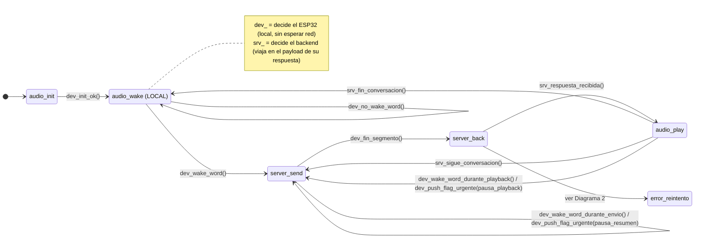
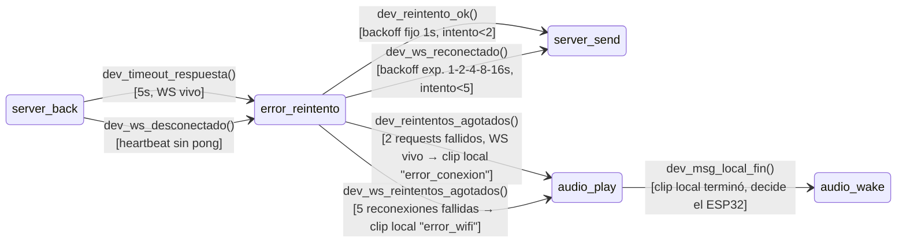

### Diagrama 1 — loop principal (camino feliz)

### Diagrama 2 — subsistema de error / reintento (detalle de `server_back → error_reintento`)

## Quién decide cada transición (`dev_` vs `srv_`)

| Transición                                                           | Quién decide | Por qué                                                                                                                                                                                                                                                                                  |
| -------------------------------------------------------------------- | ------------ | ---------------------------------------------------------------------------------------------------------------------------------------------------------------------------------------------------------------------------------------------------------------------------------------- |
| `dev_init_ok()`                                                      | ESP32        | Resultado de inicializar hardware local (I2S, PSRAM) — el backend ni existe todavía en este punto.                                                                                                                                                                                       |
| `dev_no_wake_word()` / `dev_wake_word()`                             | ESP32        | Detección local (modelo de Edge Impulse on-device) — tiene que ser instantánea, no puede depender de la red.                                                                                                                                                                                            |
| `dev_wake_word_durante_envio()` / `dev_wake_word_durante_playback()` | ESP32        | Misma razón: detectar la wake word es siempre local.                                                                                                                                                                                                                                     |
| `dev_fin_segmento()`                                                  | ESP32        | Corte de segmento (timer/VAD/buffer lleno) — es una decisión sobre la señal de audio cruda, que el backend ni tiene todavía en tiempo real. Ver contraargumento más abajo sobre por qué esto NO debería depender del servidor.                                                              |
| `srv_respuesta_recibida()`                                           | Backend      | El dispositivo no puede "decidir" que hay una respuesta — solo puede esperarla. El backend es quien la genera y la manda cuando está lista.                                                                                                                                              |
| `srv_fin_conversacion()` / `srv_sigue_conversacion()`                              | Backend      | Esto no es "terminó de sonar el audio" (eso sería local) — es "¿la conversación sigue o se terminó?", una decisión semántica (¿el médico se despidió? ¿hay más para tratar con este paciente?) que solo el backend puede tomar, porque solo él entiende el contenido de la conversación. |

Regla general: si la decisión depende de **la señal de audio en el momento** (VAD, wake word, buffer) → `dev_`, es local y no puede esperar a la red. Si la decisión depende de **entender el contenido/contexto de la conversación** → `srv_`, porque solo el backend tiene esa información.

## Notas de diseño pendientes

> [!success] Resuelto: timeout de `server_back` y estado `error_reintento`
> Se separan dos fallas distintas porque requieren manejo distinto:
> - **WS vivo, sin respuesta** (`dev_timeout_respuesta()`, 5 s desde el último byte enviado — streaming en paralelo hace que una respuesta normal cierre casi inmediato, así que 5 s ya es anómalo): reintento del *request*, backoff fijo 1 s, máx. 2 intentos. Agotados → se descarta el segmento pendiente, se reproduce un clip local ("error_conexion") y vuelve a `audio_wake` (no hay backlog SD todavía, ver punto pendiente del roadmap "resiliencia offline").
> - **WS caído** (`dev_ws_desconectado()`, vía heartbeat: ping cada 10 s, sin pong en 3 s = caído): reconexión de *socket*, backoff exponencial 1-2-4-8-16 s, máx. 5 intentos. Agotados → se reproduce un clip local ("error_wifi") y vuelve a `audio_wake`.
> - Ambos casos pasan por `audio_play`, pero saliendo por `dev_msg_local_fin()` (lo decide el ESP32 porque terminó su propio clip) en vez de `srv_fin_conversacion()`/`srv_sigue_conversacion()` (que dependen del backend) — un mensaje de error local no tiene backend del otro lado tomando esa decisión.
>
> [!question] Abierto: los clips de error (`error_conexion.wav`, `error_wifi.wav`) tienen que estar pregrabados y guardados en el propio ESP32 (flash/SPIFFS) — no se le pueden pedir al backend si el problema es justamente que no hay backend. Etapa 1 solo grabó/mandó audio, nunca reprodujo nada local; hay que definir dónde vive el audio de reproducción (driver de salida, formato, capacidad de flash) antes de picar código de esto. ¿Seguimos con LED además del audio, o el audio solo ya cubre la necesidad de avisar al médico?
>
> [!question] Abierto: el heartbeat de WS hoy solo se dibujó saliendo de `server_back`. Un socket caído mientras el dispositivo está en `server_send` o `audio_play` no tiene todavía un arco explícito — evaluar si conviene que el heartbeat sea un evento global (interrumpe cualquier estado "ocupado" con red) en vez de estar atado solo a la espera de respuesta.

> [!info] Arquitectura real: escucha continua en background, no "un pedido = un envío"
> El uso real no es "wake word dispara un pedido puntual aislado". El médico se loguea por NFC al arrancar el turno, y le pide a Órbita que **resuma y anote continuamente durante toda la consulta**. Preguntas puntuales tipo "Órbita, ¿qué hora es?" ocurren *en medio* de esa escucha continua. El loop ya dibujado (`server_send → server_back → audio_play → server_send`, vía `srv_sigue_conversacion`) cubre el caso base: cada segmento de audio pasa por send → back → play (play no hace nada si la respuesta no trae audio, como en un segmento normal de resumen) → send de nuevo.

> [!info] Prioridad de pedidos: la resuelve el backend, no el ESP32 — y es secuencial, no concurrente
> Decisión (corregida): si la wake word dispara mientras ya se está en `server_send` (mandando un segmento de fondo), el dispositivo **pausa el envío del resumen** — no lo mezcla con el audio urgente, porque mandar ambas cosas a la vez confundiría al backend sobre qué es qué. La secuencia es: (1) detecta wake word en medio de un segmento de fondo, (2) manda un flag avisando "resumen en pausa, viene un pedido urgente", (3) graba y manda el audio urgente (sigue siendo el mismo estado `server_send`, pero ahora mandando el audio urgente, no el de fondo), (4) `server_back` espera la respuesta, (5) `audio_play` la reproduce, (6) vuelve a `server_send` y **retoma** el resumen de fondo. No hace falta que el envío y la recepción corran en paralelo — es un único camino secuencial, el mismo loop de siempre. El backend, de su lado, entiende que el resumen queda en pausa hasta que termina de contestar lo urgente.

> [!question] Abierto: tamaño de segmento (`dev_fin_segmento`)
> Respuesta parcial: "lo más chico posible sin generar problemas no controlables" — falta un número concreto (ms) y un criterio de corte (tiempo fijo / VAD / límite de buffer en PSRAM) para poder dimensionar buffers y estimar la latencia máxima de respuesta a una pregunta puntual.

> [!question] Abierto: qué pasa con el `audio_play` interrumpido, una vez atendida la urgencia
> Para `server_send` esto ya está resuelto (retomar el siguiente segmento del resumen es natural, no hay "posición" que preservar). Para `audio_play` es distinto: si se corta una respuesta larga a mitad de reproducción, ¿se retoma desde donde quedó, se reinicia desde el principio, o se descarta directamente (el médico ya se distrajo con la urgencia, puede volver a pedirla si la necesita)? Mismo tipo de decisión que se tomó para el resumen, pendiente de definir para este caso.

## Desarrollo del mecanismo de interrupción urgente

El mecanismo es genérico: cualquier estado "ocupado" con una operación de larga duración (`server_send` mandando el resumen de fondo, o `audio_play` reproduciendo una respuesta larga) puede ser interrumpido por una nueva wake word con un pedido urgente. No es exclusivo del resumen.

### Caso A — interrupción durante `server_send` (ya resuelto)

El dispositivo está en `server_send` mandando un segmento de audio de fondo (resumen continuo de la consulta) cuando se detecta la wake word "Órbita" de nuevo, con un pedido puntual (ej. "¿qué hora es?").

1. El dispositivo está en `server_send`, mandando un segmento del resumen de fondo (segmento corto, pensado para minimizar latencia).
2. Se detecta la wake word de nuevo → el dispositivo **corta el envío del segmento de fondo** (no lo sigue mandando) y manda un flag/aviso de urgencia al servidor, indicando que el resumen queda en pausa.
3. El servidor recibe el aviso y pausa su propio procesamiento del resumen — lo apila en su pila/cola de prioridad de pedidos, para retomarlo después.
4. El dispositivo graba y manda el audio del pedido urgente (mismo estado `server_send`, pero mandando el audio urgente en vez del segmento de fondo — así el backend nunca recibe los dos mezclados).
5. El dispositivo entra a `server_back` y espera la respuesta del pedido urgente.
6. `audio_play` reproduce esa respuesta (ej. la hora), y el dispositivo vuelve a `server_send`, **retomando** el envío del resumen de fondo donde había quedado pausado.

Es un único camino secuencial — no hace falta que el dispositivo mande y reciba en paralelo. El backend es quien administra la pausa/reanudación del resumen y la prioridad entre pedidos; el dispositivo solo avisa, pausa su propio envío de fondo, atiende lo urgente, y retoma.

### Caso B — interrupción durante `audio_play` (mismo patrón, un punto pendiente)

El dispositivo está en `audio_play` reproduciendo una respuesta larga del backend cuando se detecta la wake word de nuevo.

1. El dispositivo está en `audio_play`, reproduciendo una respuesta.
2. Se detecta la wake word de nuevo → el dispositivo **corta la reproducción en curso** y manda un flag/aviso de urgencia al servidor (transición a `server_send`, análoga a la del caso A pero disparada desde `audio_play`).
3. El servidor pausa lo que estaba devolviendo, igual que en el caso A.
4. El dispositivo graba y manda el audio del pedido urgente.
5. `server_back` espera la respuesta urgente, `audio_play` la reproduce.
6. **Pendiente:** qué pasa con la reproducción original interrumpida en el paso 1 — ¿se retoma, se reinicia, o se descarta? (ver nota de diseño arriba). A diferencia del resumen, acá sí hay contenido específico que se cortó a mitad de camino, no es un flujo continuo sin "posición".
