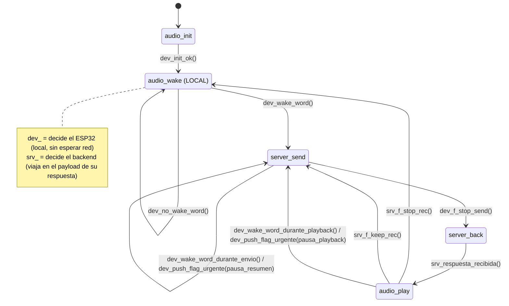

## Quién decide cada transición (`dev_` vs `srv_`)

| Transición | Quién decide | Por qué |
|---|---|---|
| `dev_init_ok()` | ESP32 | Resultado de inicializar hardware local (I2S, PSRAM) — el backend ni existe todavía en este punto. |
| `dev_no_wake_word()` / `dev_wake_word()` | ESP32 | Detección local (WakeNet on-device) — tiene que ser instantánea, no puede depender de la red. |
| `dev_wake_word_durante_envio()` / `dev_wake_word_durante_playback()` | ESP32 | Misma razón: detectar la wake word es siempre local. |
| `dev_f_stop_send()` | ESP32 | Corte de chunk (timer/VAD/buffer lleno) — es una decisión sobre la señal de audio cruda, que el backend ni tiene todavía en tiempo real. Ver contraargumento más abajo sobre por qué esto NO debería depender del servidor. |
| `srv_respuesta_recibida()` | Backend | El dispositivo no puede "decidir" que hay una respuesta — solo puede esperarla. El backend es quien la genera y la manda cuando está lista. |
| `srv_f_stop_rec()` / `srv_f_keep_rec()` | Backend | Esto no es "terminó de sonar el audio" (eso sería local) — es "¿la conversación sigue o se terminó?", una decisión semántica (¿el médico se despidió? ¿hay más para tratar con este paciente?) que solo el backend puede tomar, porque solo él entiende el contenido de la conversación. |

Regla general: si la decisión depende de **la señal de audio en el momento** (VAD, wake word, buffer) → `dev_`, es local y no puede esperar a la red. Si la decisión depende de **entender el contenido/contexto de la conversación** → `srv_`, porque solo el backend tiene esa información.

## Notas de diseño pendientes

> [!warning] Cierre de `server_send` (EV_RESPONSE_RECEIVED) sin timeout
> El estado de envío se cierra solo cuando llega la respuesta del backend (flag lógica, no confirmación de bytes enviados). Sin un timeout, un backend caído o una respuesta perdida deja al dispositivo colgado indefinidamente en `server_back` — sin pantalla, sin forma de que el médico se entere. El timeout es obligatorio para que `error-reintento` (Etapa 3 del roadmap) sea alcanzable.

> [!info] Arquitectura real: escucha continua en background, no "un pedido = un envío"
> El uso real no es "wake word dispara un pedido puntual aislado". El médico se loguea por NFC al arrancar el turno, y le pide a Órbita que **resuma y anote continuamente durante toda la consulta**. Preguntas puntuales tipo "Órbita, ¿qué hora es?" ocurren *en medio* de esa escucha continua. El loop ya dibujado (`server_send → server_back → audio_play → server_send`, vía `f_keep_rec`) cubre el caso base: cada chunk de audio pasa por send → back → play (play no hace nada si la respuesta no trae audio, como en un chunk normal de resumen) → send de nuevo.

> [!info] Prioridad de pedidos: la resuelve el backend, no el ESP32 — y es secuencial, no concurrente
> Decisión (corregida): si la wake word dispara mientras ya se está en `server_send` (mandando un chunk de fondo), el dispositivo **pausa el envío del resumen** — no lo mezcla con el audio urgente, porque mandar ambas cosas a la vez confundiría al backend sobre qué es qué. La secuencia es: (1) detecta wake word en medio de un chunk de fondo, (2) manda un flag avisando "resumen en pausa, viene un pedido urgente", (3) graba y manda el audio urgente (sigue siendo el mismo estado `server_send`, pero ahora mandando el audio urgente, no el de fondo), (4) `server_back` espera la respuesta, (5) `audio_play` la reproduce, (6) vuelve a `server_send` y **retoma** el resumen de fondo. No hace falta que el envío y la recepción corran en paralelo — es un único camino secuencial, el mismo loop de siempre. El backend, de su lado, entiende que el resumen queda en pausa hasta que termina de contestar lo urgente.

> [!question] Abierto: tamaño de chunk (`f_stop`)
> Respuesta parcial: "lo más chico posible sin generar problemas no controlables" — falta un número concreto (ms) y un criterio de corte (tiempo fijo / VAD / límite de buffer en PSRAM) para poder dimensionar buffers y estimar la latencia máxima de respuesta a una pregunta puntual.

> [!question] Abierto: qué pasa con el `audio_play` interrumpido, una vez atendida la urgencia
> Para `server_send` esto ya está resuelto (retomar el siguiente chunk del resumen es natural, no hay "posición" que preservar). Para `audio_play` es distinto: si se corta una respuesta larga a mitad de reproducción, ¿se retoma desde donde quedó, se reinicia desde el principio, o se descarta directamente (el médico ya se distrajo con la urgencia, puede volver a pedirla si la necesita)? Mismo tipo de decisión que se tomó para el resumen, pendiente de definir para este caso.

## Desarrollo del mecanismo de interrupción urgente

El mecanismo es genérico: cualquier estado "ocupado" con una operación de larga duración (`server_send` mandando el resumen de fondo, o `audio_play` reproduciendo una respuesta larga) puede ser interrumpido por una nueva wake word con un pedido urgente. No es exclusivo del resumen.

### Caso A — interrupción durante `server_send` (ya resuelto)

El dispositivo está en `server_send` mandando un chunk de audio de fondo (resumen continuo de la consulta) cuando se detecta la wake word "Órbita" de nuevo, con un pedido puntual (ej. "¿qué hora es?").

1. El dispositivo está en `server_send`, mandando un chunk del resumen de fondo (chunk corto, pensado para minimizar latencia).
2. Se detecta la wake word de nuevo → el dispositivo **corta el envío del chunk de fondo** (no lo sigue mandando) y manda un flag/aviso de urgencia al servidor, indicando que el resumen queda en pausa.
3. El servidor recibe el aviso y pausa su propio procesamiento del resumen — lo apila en su pila/cola de prioridad de pedidos, para retomarlo después.
4. El dispositivo graba y manda el audio del pedido urgente (mismo estado `server_send`, pero mandando el audio urgente en vez del chunk de fondo — así el backend nunca recibe los dos mezclados).
5. El dispositivo entra a `server_back` y espera la respuesta del pedido urgente.
6. `audio_play` reproduce esa respuesta (ej. la hora), y el dispositivo vuelve a `server_send`, **retomando** el envío del resumen de fondo donde había quedado pausado.

Es un único camino secuencial — no hace falta que el dispositivo mande y reciba en paralelo. El backend es quien administra la pausa/reanudación del resumen y la prioridad entre pedidos; el dispositivo solo avisa, pausa su propio envío de fondo, atiende lo urgente, y retoma.

### Caso B — interrupción durante `audio_play` (mismo patrón, un punto pendiente)

El dispositivo está en `audio_play` reproduciendo una respuesta larga del backend cuando se detecta la wake word de nuevo.

1. El dispositivo está en `audio_play`, reproduciendo una respuesta.
2. Se detecta la wake word de nuevo → el dispositivo **corta la reproducción en curso** y manda un flag/aviso de urgencia al servidor (transición a `server_send`, análoga a la del caso A pero disparada desde `audio_play`).
3. El servidor pausa lo que estaba devolviendo, igual que en el caso A.
4. El dispositivo graba y manda el audio del pedido urgente.
5. `server_back` espera la respuesta urgente, `audio_play` la reproduce.
6. **Pendiente:** qué pasa con la reproducción original interrumpida en el paso 1 — ¿se retoma, se reinicia, o se descarta? (ver nota de diseño arriba). A diferencia del resumen, acá sí hay contenido específico que se cortó a mitad de camino, no es un flujo continuo sin "posición".
